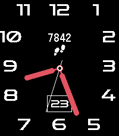
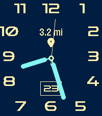
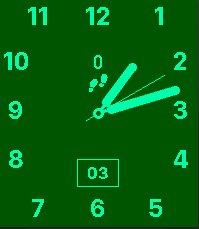
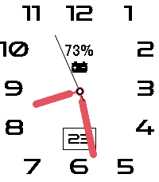

# Pear Hermit California

An analog watchface for Pebble Time 2 (Emery) with full color customization.


## Features

- Analog clock with hour numbers (1-12) in San Francisco font arranged in a rounded-rectangle layout
- Two hand rendering modes: opaque (filled) and transparent (outlined)
- Date display in a bordered box
- Fully configurable via phone settings (Clay):
  - Background color (64-color palette)
  - Dial color
  - Hour/minute hands color
  - Transparent hands toggle
- All settings persist across reboots

## Building

Requires the Pebble SDK.

```
pebble build
pebble install --emulator emery
```

## Screenshots

| Default | Navy / Yellow | Forest | Inverted |
|---------|--------------|--------|----------|
|  |  |  |  |

## License

MIT
